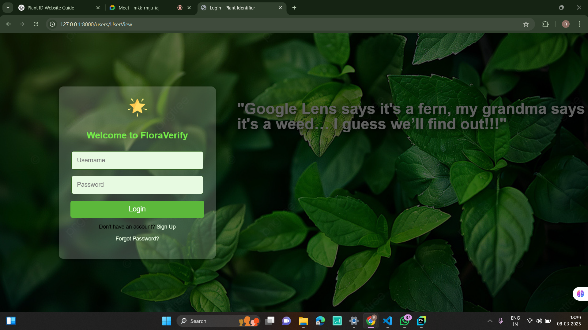
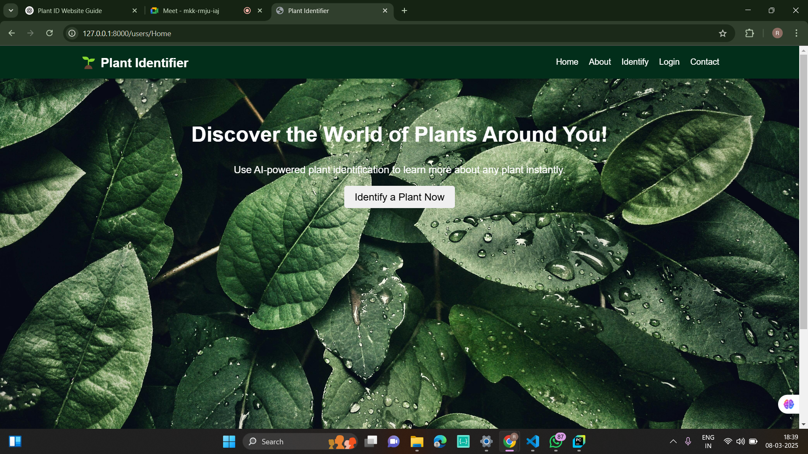
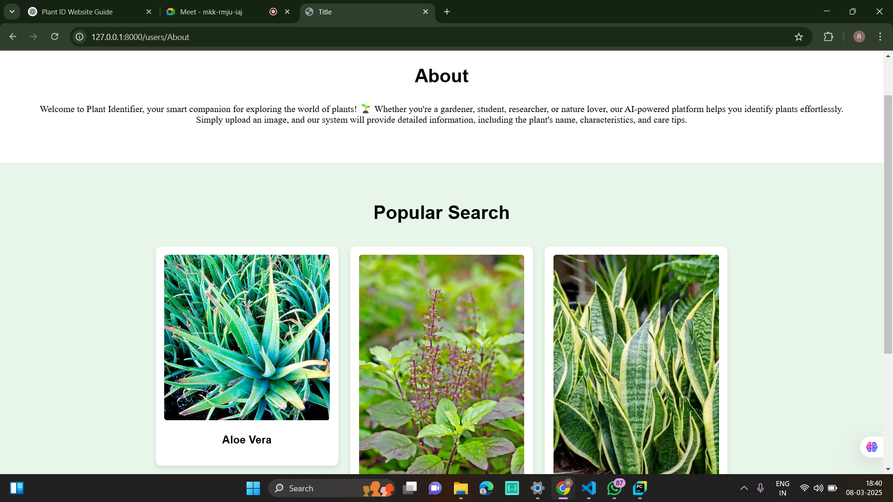
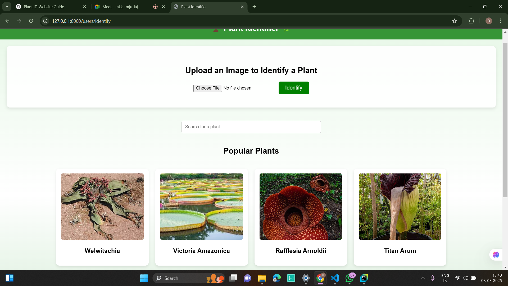

# PlantNet App

PlantNet is a Flutter-based plant identification app that allows users to identify plants by uploading images. It also includes features like user authentication, plant history, and an about section.

## Features

- **User Authentication**: Signup and Login using email or Google authentication.
- **Plant Identification**: Upload an image of a plant to get details.
- **User Dashboard**: View identified plants and user profile.
- **Home Page**: Explore various plant-related insights.
- **About Page**: Learn more about the app and its purpose.

## Screenshots

### Login Page


### Signup Page


### Home Page


### About Page


### Identify Page


## Installation

1. Clone the repository:
   ```sh
   git clone https://github.com/your-repo/plantnet-app.git
   ```
2. Navigate to the project directory:
   ```sh
   cd plantnet-app
   ```
3. Install dependencies:
   ```sh
   flutter pub get
   ```
4. Run the app:
   ```sh
   flutter run
   ```

## Technologies Used
- Flutter
- Firebase Authentication
- Machine Learning Model for Plant Identification

## Contribution
Feel free to contribute! Fork the repository and submit a pull request.


